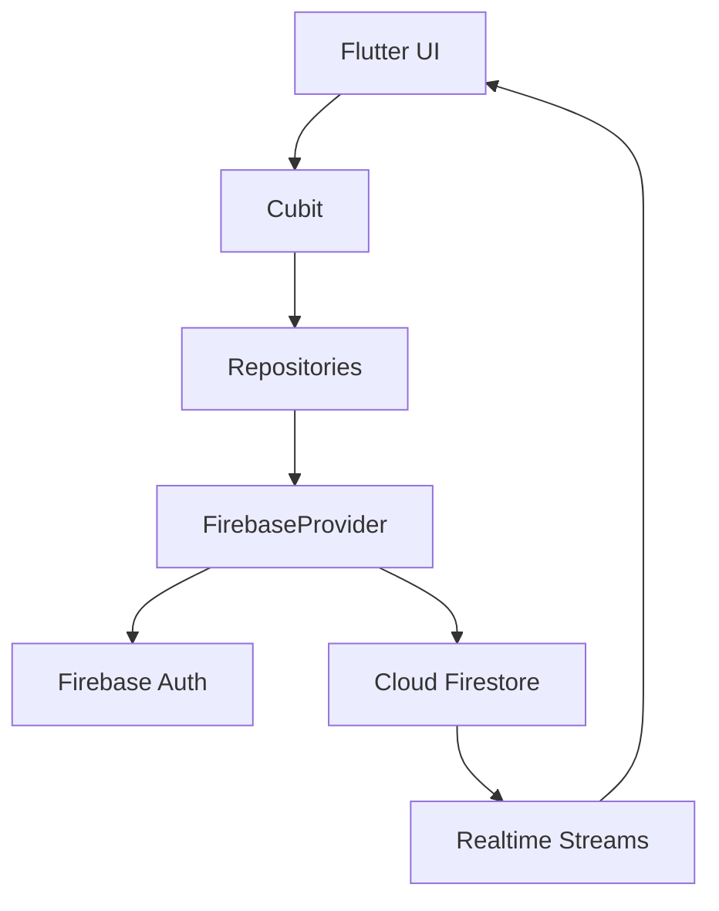

# Saint Paul

Saint Paul is a Flutter app for church student follow-up, with dedicated experiences for teachers and students.

## What This App Does

- Teacher side: manage students, missions, groups, and rankings 🧑‍🏫
- Student side: follow missions, check profile, and track leaderboard progress 🎯
- Live updates from Firestore for leaderboard and related lists ⚡

## Quick Tech Snapshot

- Flutter + Dart
- Cubit (`flutter_bloc`)
- Firebase Authentication + Cloud Firestore
- `go_router` for navigation
- Arabic-first UI with localization support

## Project Structure

```text
lib/
  core/
  feature/
    auth/
    home/
    missions/
    groups/
    profile/
    main/
    splash/
    welcome/
  components/
```

## Setup (Project Only)

Make sure Firebase is connected for this project, and these files exist:

- `android/app/google-services.json`
- `ios/Runner/GoogleService-Info.plist`

Then run:

```bash
flutter pub get
```

Optional (if needed):

```bash
flutterfire configure
```

## Common Commands

```bash
flutter run
flutter analyze
flutter test
flutter build apk
flutter build apk --split-per-abi
flutter build appbundle
```

## Architecture (Simple)



## Screenshots Placeholders

Put screenshots in `docs/screens` using these names.

### App Entry and Auth


### Teacher Screens


### Student Screens


## Notes

- Leaderboard-related screens use Firestore streams, so updates appear in near real-time.
- Main route map lives in `lib/core/routes/routes.dart`.
