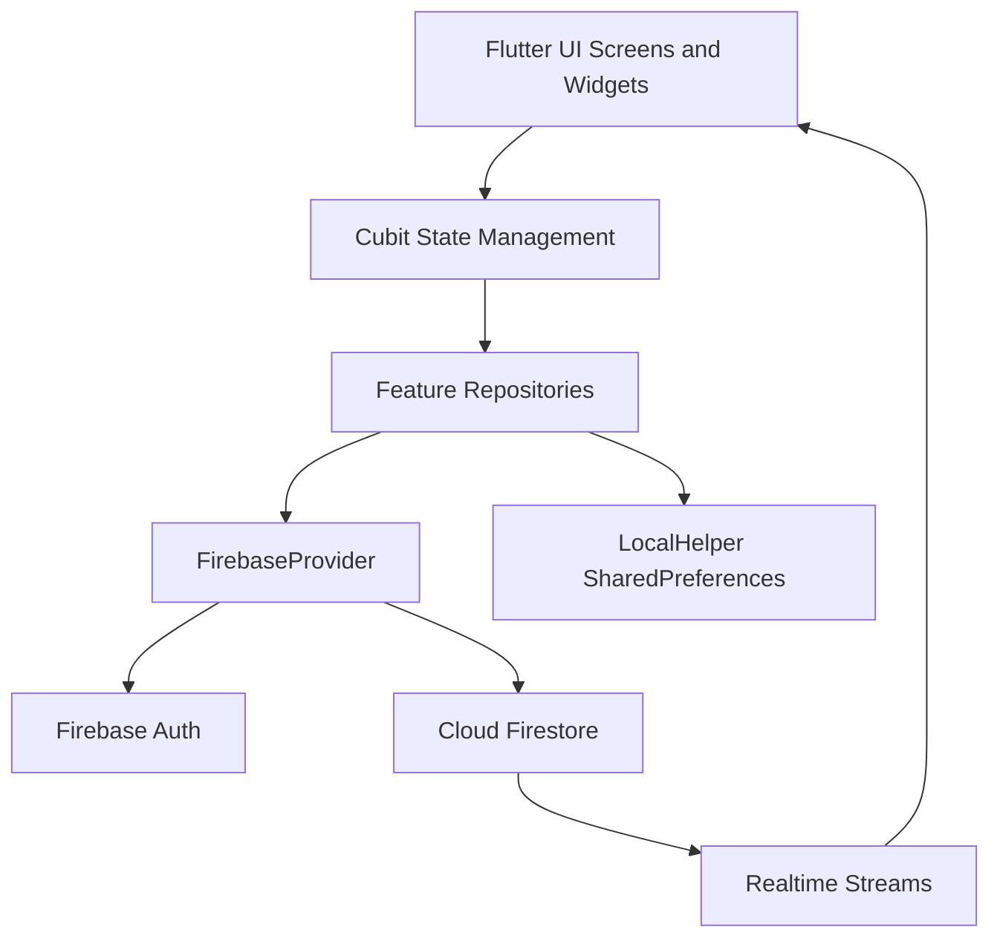

# Saint Paul

Saint Paul is a Flutter application for church student follow-up, with dedicated experiences for teachers and students.

It supports student management, mission workflows, group organization, and real-time score leaderboards powered by Firebase.

## Table of Contents

- Bilingual Summary
- Product Snapshot
- Core Capabilities
- Tech Stack
- Architecture and Design
- Architecture Diagram
- Project Structure
- Quick Start
- Firebase Configuration
- Commands
- Release and Deployment
- Routing and App Flow
- Screen Gallery (Placeholders)
- Firestore Data Overview
- Operational Notes
- Team Onboarding and Contribution

## Bilingual Summary

### English

Saint Paul helps teachers and students manage missions, groups, and ranking progress in one mobile app, with role-based experiences and real-time Firebase-backed updates.

### العربية

تطبيق Saint Paul يساعد الخدام والمخدومين على إدارة المهام والمجموعات ومتابعة الترتيب في تطبيق واحد، مع تجربة مختلفة لكل دور وتحديثات فورية عبر Firebase.

## Product Snapshot

Target users:

- Teacher: create and manage students, missions, groups, and rankings.
- Student: track progress, complete missions, view group and profile.

Key product characteristics:

- Arabic-first UI with localization support enabled.
- Real-time list updates for leaderboard and related dashboards.
- Role-aware navigation and tab sets.

## Core Capabilities

### Authentication and Session

- Email/password login and registration.
- Password reset by email.
- Role-based routing after sign-in.
- Local cache for user context and lightweight session metadata.

### Leaderboards and Tayo Tracking

- Students ranked by total tayo.
- Teacher deep-dive on per-student tayo details.
- Study-level-aware leaderboard views.

### Missions

- Teacher creates, edits, and deletes missions.
- Student accepts or un-accepts missions.
- Student submits mission solutions.
- Submission and acceptance state tracked per student.

### Groups

- Teacher creates and manages groups.
- Student assignment into groups.
- Group aggregate score derived from member totals.
- Student can view own group details and members.

### Profiles and Student Admin

- Student profile and badge display.
- Teacher can add, edit, and delete student records.
- Student avatar update support.

## Tech Stack

- Flutter and Dart
- flutter_bloc (Cubit)
- go_router
- Firebase Authentication
- Cloud Firestore
- shared_preferences
- cached_network_image, flutter_svg, lottie, gap
- flutter_localizations

## Architecture and Design

The app follows a feature-first modular structure:

- Presentation layer: pages, widgets, cubits, states
- Data layer: repositories per feature
- Core layer: models, services, routes, styles, constants

Typical flow:

1. View triggers Cubit action.
2. Cubit calls feature repository.
3. Repository delegates to Firebase provider.
4. UI updates via state emissions or Firestore stream snapshots.

## Architecture Diagram



## Project Structure

```text
lib/
  core/
    constants/
    models/
    routes/
    services/
    utils/
  feature/
    auth/
    groups/
    home/
    main/
    missions/
    profile/
    splash/
    welcome/
  components/
```

## Quick Start

### Prerequisites

- Flutter SDK compatible with pubspec constraints
- Firebase project with Auth and Firestore enabled
- Android Studio or VS Code with Flutter tooling

### Install

```bash
flutter pub get
```

### Optional: Regenerate Firebase Options

```bash
flutterfire configure
```

## Firebase Configuration

Required platform files:

- Android: android/app/google-services.json
- iOS: ios/Runner/GoogleService-Info.plist

Enable Firebase services:

- Authentication (Email/Password)
- Cloud Firestore

## Commands

Run app:

```bash
flutter run
```

Analyze:

```bash
flutter analyze
```

Test:

```bash
flutter test
```

Build APK:

```bash
flutter build apk
```

Build split APKs:

```bash
flutter build apk --split-per-abi
```

## Release and Deployment

### Android Release (Recommended)

```bash
flutter build appbundle
```

Generated artifact:

- build/app/outputs/bundle/release/app-release.aab

### Android APK Release

```bash
flutter build apk --release
```

### iOS Release Build (macOS required)

```bash
flutter build ipa
```

### Pre-Release Checklist

- Run flutter analyze with no new issues.
- Run flutter test.
- Verify Firebase project is correct for the target environment.
- Verify login, role routing, and one full teacher and student flow.

## Routing and App Flow

Central route map is defined in lib/core/routes/routes.dart.

High-level flow:

1. Splash
2. Welcome or auto-forward based on cached/auth state
3. Login/Register
4. Main shell with role-specific tabs

Major feature route families:

- Auth and onboarding
- Home and leaderboard
- Missions
- Groups
- Profile and badges

## Screen Gallery (Placeholders)

Store screenshots under docs/screens using these names.

### App Entry and Auth

#### Splash


#### Welcome


#### Login


#### Register


#### Email (Forgot Password)


#### OTP


#### New Password


#### Password Changed


### Main Shell

#### Main Tabs (Teacher)


#### Main Tabs (Student)


### Teacher Screens

#### Teacher Home (Leaderboard)


#### Tayo Details


#### Birthday Screen


#### Teacher Missions


#### Create or Edit Mission


#### Groups Showcase


#### Create Group


#### Group Details (Teacher)


#### Students Showcase and Edit


#### Add or Edit Student


### Student Screens

#### Student Home (Leaderboard)


#### Student Missions


#### Mission Details


#### Group Details (Student)


#### Student Profile


#### Badges


## Firestore Data Overview

Main collections:

- Student
- Teacher
- Mission
- Group

Key relationships:

- Student may reference groupID.
- Group stores student ID list.
- Student stores mission acceptance/submission state.

## Operational Notes

- Leaderboards are stream-based, so UI reflects writes in near real-time.
- Role state is used to determine tabs and route entry points.
- Local cache is used for selected user metadata.

## Team Onboarding and Contribution

Recommended workflow:

1. Create a branch per feature or fix.
2. Keep state, repository, and UI changes scoped by feature module.
3. Run analyze and tests before opening PR.
4. Update routes, docs, and screenshot placeholders when adding screens.

Minimal pre-PR checklist:

- App launches and login works
- Target flow tested manually (teacher or student)
- No analyzer warnings introduced
- README updated when user-facing behavior changed
